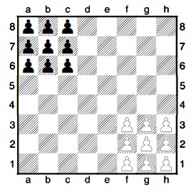
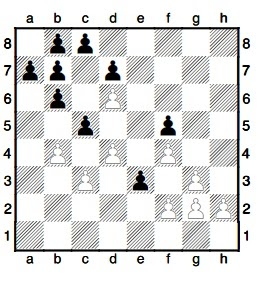

# junor-challenge
Тестовое задание

## About
Тестовое задание “Уголки” разбито на на уровни сложности. Каждый уровень добавляет некоторый функционал в игру. Все уровни кроме первого опциональны и просто добавляют тебе бонусов. 
Игру необходимо реализовать на движке Godot (https://godotengine.org/) последней стабильной версии (3.2.1).
Результат нужно выложить на приватный репозиторий github и пригласить в него `jkb0o` и `sdshorin` . Папку .import нужно добавить в .gitignore! Понятная, детальная и неперегруженная история коммитов - большой плюс.

Тебе наверняка пригодится внимательно прочитать [туториалы](http://docs.godotengine.org/en/stable/), особенно рекомендую разделы [Step by Step](http://docs.godotengine.org/en/stable/getting_started/step_by_step/index.html) и [2D](http://docs.godotengine.org/en/stable/tutorials/2d/index.html).

## Правила игры.
После расстановки фигур на шахматной доске каждый игрок ходит по очереди. Во время хода он может переместить одну фигуру. Побеждает игрок который расставит все свои фигуры на место фигур противника. 
Расстановка фигур в начале игры:

## Возможные ходы:
Игрок может подвинуть фигуру на свободное место по горизонтали/вертикали/диагонали
Можно Пешками перепрыгивать через свои и чужие Пешки. Можно перепрыгивать за один ход несколько раз подряд.
- Например, Пешка g2 может перепрыгнуть несколько Пешек и оказаться на а8!
			`1. g2–e2–е4–с4–с6–а6–а8.`
- Чёрная Пешка b7, в свою очередь, допрыгнет до поля h1.
			`1. ... b7–b5–b3–d3–f3–h3–h1`

